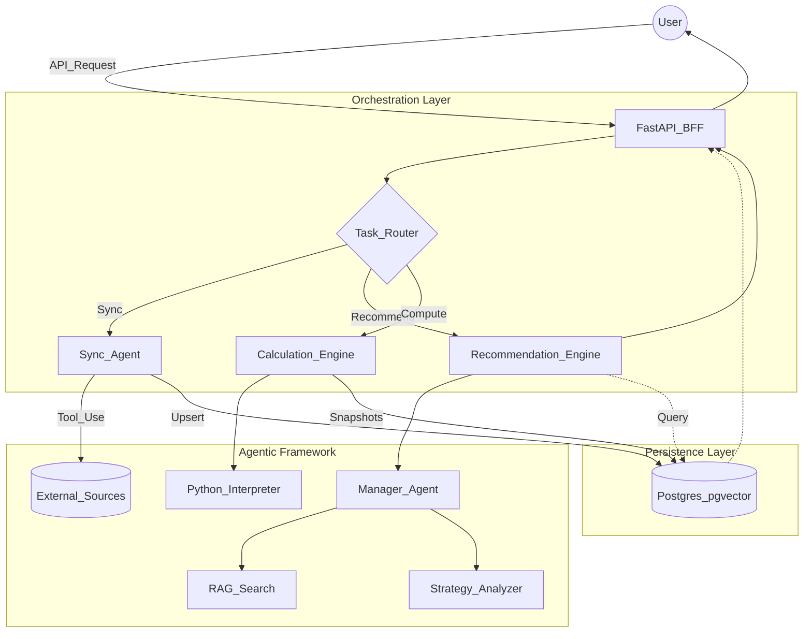
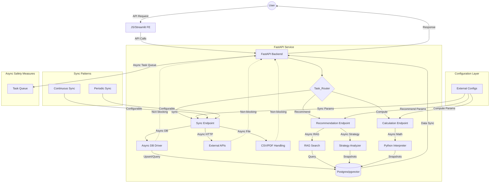

# Solution Architecture

## High Level Architecture Breakdown

Main sections:

1. Presentation Level (streamlit / JS)

3. BFF Level (FastAPI / orchestration)
3. Synchronization Level (Agent Tools / CrewAI or pydantic.ai)
4. Recommendation Engine (Multi-Agentic / CrewAI or pydantic.ai)
5. Calculation Engine (Agent Tools / CrewAI or pydantic.ai)

6. Persistence (Postgres / pgvector)

## Orchestration and Muti-Agent Architecture

Here is the high level architecture diagram - not fine-tuned and verified yet:

## Data Synchronization Conventions
Two runtimes:
- Continuous
- Personal periodic

Schould be:
- universal: whether it's continuous or periodic, before generation of recommendations, the state fo available data should be equally synchronized. 
- configurable: the parameters of the synchronization should be externalized from the codebase.

## Refactored Diagram

## Consider FastAPI Potential Problems

Common Event Loop Killers (seen in production):
- Using sync DB drivers inside async endpoints
- Blocking file I/O (PDFs, images, CSV exports)
- CPU‑heavy JSON serialization
- Third‑party SDKs that secretly block
- Poor retry logic with time.sleep()
- Pandas or NumPy inside request handlers
When planning respective tasks in a monolith application based on FastAPI we need to be aware of these problems and avoid them. 

## Questions To Consider

1. Should we have RAG? Any rules, policies? Third party analysis and recommendations?
2. Data persistence:
   1. What historical tail of data we need to keep?
   2. If there any aggregations calculated?
   3. Any calculation snapshots? Make sense if the system provides recommendations at the certain timepoint (traceability, auditability).
3. How to handle the data privacy? Even in personal system makes sense to consider.
4. How to handle the data quality? Missing values (mainly), etc.

